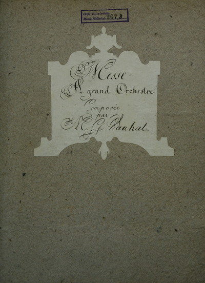

# Missa in G

_Johann Baptist Wanhal (attribution dubious)_

Notes from _Catalogus novus Wanhali_:
> This work survives only in one peripheral source. It is stylistically
> plausible in, but employs tempo markings that either are not found in other
> masses (Andantino) or seem unusual for their context (Andante for the
> _Kyrie_), and no other work sets the _Crucifixus_ as a separate movement. The
> continuo section being tacet in the _Gratias_ and _Et incarnatus_ is also
> highly suspect.  Note that each section of the mass seems to be set in
> different tonalities, and that the Credo does not end with the same tonality
> as it began. As with Nokki dubious 4, this might be a mixing of music from
> different sources, where one or more movements are by Wanhal, but it has not
> been possible to provide any examples of borrowings from other works.

## Kyrie

### 1. Kyrie

_Andante_: 2/4, G major, 1-202 (202 bars)

| Ob I/II | Cor I/II | SATB     | Vl I/II | Vla | Vlc | Org
| ------- | -------- | -------- | ------- | --- | --- | ---
| ⬜️⬜️    | ⬜️⬜️     | ✅✅✅✅ | ⬜️⬜️    | ⬜️  | ✅  | ⬜️

## Gloria

### 2. Gloria

_Adagio_: 4/4, D major, 1-5 (5 bars)  
_Allegro_: 4/4, D major, 6-96 (91 bars)

| Ob I/II | Cor I/II | SATB     | Vl I/II | Vla | Vlc | Org
| ------- | -------- | -------- | ------- | --- | --- | ---
| ✅✅    | ✅✅     | ✅✅✅✅ | ✅✅    | ✅  | ✅  | ⬜

### 3. Gratias

_Andante_: 2/4, G major, 97-224 (128 bars)

| SATB     | Vl I/II | Vla I/II | Vlc
| -------- | ------- | -------- | ---
| ✅✅✅✅ | ✅✅    | ✅✅     | ✅

### 4. Quoniam

_Allegro moderato_: 3/4, C major, 225-376 (152 bars)

| Ob I/II | Cor I/II | B   | Vl I/II | Vla | Vlc | Org
| ------- | -------- | --- | ------- | --- | --- | ---
| ✅✅    | ✅✅     | ✅  | ✅✅    | ✅  | ✅  | ⬜

### 5. Cum Sancto

_Adagio_: 4/4, D major, 377-381 (5 bars)  
_Allegro alla capella_: 4/4, D major, 382-467 (86 bars)

| Ob I/II | Cor I/II | SATB     | Vl I/II | Vla | Vlc | Org
| ------- | -------- | -------- | ------- | --- | --- | ---
| ✅✅    | ✅✅     | ✅✅✅✅ | ✅✅    | ✅  | ✅  | ⬜

## Credo

### 6. Credo

_Andantino_: 6/8, A major, 1-53 (53 bars)

| SATB     | Vl I/II | Vla | Vlc | Org
| -------- | ------- | --- | --- | ---
| ✅✅✅✅ | ✅✅    | ✅  | ✅  | ⬜️

### 7. Et incarnatus

_Adagio_: 2/4, A major, 54-121 (68 bars)

| SA   | Vl I/II | Vla | Vlc
| ---- | ------- | --- | ---
| ✅✅ | ✅✅    | ✅  | ✅

### 8. Crucifixus

_Adagio_: 2/2, A minor, 122-149 (28 bars)

| SATB     |
| -------- |
| ✅✅✅✅ |

### 9. Et resurrexit

_Allegro assai_: 4/4, D major, 150-276 (127 bars)

| Ob I/II | Cor I/II | SATB     | Vl I/II | Vla | Vlc | Org
| ------- | -------- | -------- | ------- | --- | --- | ---
| ✅✅    | ✅✅     | ✅✅✅✅ | ✅✅    | ✅  | ✅  | ⬜️

## Sanctus

### 10. Sanctus

_Adagio_: 3/4, D major, 1-23 (23 bars)  
_Allegro_: 4/4, D major, 24-73 (50 bars)

| Ob I/II | Cor I/II | SATB     | Vl I/II | Vla | Vlc | Org
| ------- | -------- | -------- | ------- | --- | --- | ---
| ✅✅    | ✅✅     | ✅✅✅✅ | ✅✅    | ✅  | ✅  | ⬜️

## Benedictus

### 11. Benedictus

_Andante_: 2/4, C major, 1-132 (132 bars)

| Ob I/II | Cor I/II | T  | Vl I/II | Vla | Vlc
| ------- | -------- | -- | ------- | --- | ---
| ⬜️⬜️    | ⬜️⬜️     | ⬜️ | ⬜️⬜️    | ⬜️  | ⬜️

## Agnus Dei

### 12. Agnus Dei

_Adagio_: 2/4, G minor, 1-81 (82 bars)

| SATB     | Vl I/II | Vla | Vlc | Org
| -------- | ------- | --- | --- | ---
| ✅✅✅✅ | ✅✅    | ✅  | ✅  | ⬜️

### 13. Dona nobis

_Allegro moderato_: 6/8, G major, 83-247 (165 bars)

| Ob I/II | Cor I/II | SATB     | Vl I/II | Vla | Vlc | Org
| ------- | -------- | -------- | ------- | --- | --- | ---
| ✅✅    | ✅✅     | ✅✅✅✅ | ✅✅    | ✅  | ✅  | ⬜️

