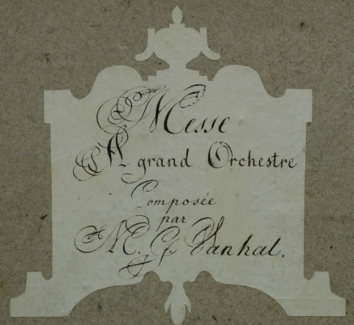

 

# Missa in G

_Johann Baptist Wanhal (attribution dubious)_

[Nokki dubious 6](https://ilmondodellaluna.com/Wanhal/d6.html)  
Weinmann XIX:G6

Notes from _Catalogus novus Wanhali_:
> This work survives only in one peripheral source. It is stylistically
> plausible in, but employs tempo markings that either are not found in other
> masses (Andantino) or seem unusual for their context (Andante for the
> _Kyrie_), and no other work sets the _Crucifixus_ as a separate movement. The
> continuo section being tacet in the _Gratias_ and _Et incarnatus_ is also
> highly suspect.  Note that each section of the mass seems to be set in
> different tonalities, and that the Credo does not end with the same tonality
> as it began. As with Nokki dubious 4, this might be a mixing of music from
> different sources, where one or more movements are by Wanhal, but it has not
> been possible to provide any examples of borrowings from other works.

## Kyrie

### 1. Kyrie

_Andante_: 2/4, G major, 1-202 (202 bars)

| Ob I/II | Cor I/II | SATB     | Vl I/II | Vla I/II | Vlc | Org
| ------- | -------- | -------- | ------- | -------- | --- | ---
| ⬜️⬜️    | ⬜️⬜️     | ⬜️⬜️⬜️⬜️ | ⬜️⬜️    | ⬜️➖     | ⬜️  | ⬜️

## Gloria

### 2. Gloria
### 3. Gratias
### 4. Quoniam
### 5. Cum Sancto

## Credo

### 6. Credo

_Andantino_: 6/8, A major, 1-53 (53 bars)

| Ob I/II | Cor I/II | SATB     | Vl I/II | Vla I/II | Vlc | Org
| ------- | -------- | -------- | ------- | -------- | --- | ---
| ➖➖    | ➖➖     | ✅✅✅✅ | ✅✅    | ✅➖     | ✅  | ⬜️

### 7. Et incarnatus

_Adagio_: 2/4, A major, 54-121 (68 bars)

| Ob I/II | Cor I/II | SATB     | Vl I/II | Vla I/II | Vlc | Org
| ------- | -------- | -------- | ------- | -------- | --- | ---
| ⬜️⬜️    | ⬜️⬜️     | ⬜️⬜️⬜️⬜️ | ⬜️⬜️    | ⬜️➖     | ⬜️  | ⬜️

### 8. Crucifixus

_Adagio: 2/2, A minor, 122-149 (28 bars)

| Ob I/II | Cor I/II | SATB     | Vl I/II | Vla I/II | Vlc | Org
| ------- | -------- | -------- | ------- | -------- | --- | ---
| ➖➖    | ➖➖     | ✅✅✅✅ | ➖➖    | ➖➖     | ➖  | ➖

### 9. Et resurrexit

_Allegro assai: 4/4, D major, 150-276 (127 bars)

| Ob I/II | Cor I/II | SATB     | Vl I/II | Vla I/II | Vlc | Org
| ------- | -------- | -------- | ------- | -------- | --- | ---
| ⬜️⬜️    | ⬜️⬜️     | ⬜️⬜️⬜️⬜️ | ⬜️⬜️    | ⬜️➖     | ⬜️  | ⬜️

## Sanctus
### 10. Sanctus

## Benedictus
### 11. Benedictus

## Agnus Dei
### 12. Agnus Dei
### 13. Dona nobis
