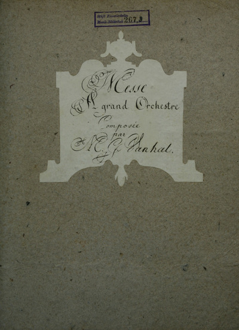

# Missa in G

_Johann Baptist Wanhal (attribution dubious)_

Notes from _Catalogus novus Wanhali_:
> This work survives only in one peripheral source. It is stylistically
> plausible in, but employs tempo markings that either are not found in other
> masses (Andantino) or seem unusual for their context (Andante for the
> _Kyrie_), and no other work sets the _Crucifixus_ as a separate movement. The
> continuo section being tacet in the _Gratias_ and _Et incarnatus_ is also
> highly suspect.  Note that each section of the mass seems to be set in
> different tonalities, and that the Credo does not end with the same tonality
> as it began. As with Nokki dubious 4, this might be a mixing of music from
> different sources, where one or more movements are by Wanhal, but it has not
> been possible to provide any examples of borrowings from other works.

**Instrumentation:** Soli (SATB), Coro (SATB), 2 Oboi, 2 Corni, 2 Violini, 2
Viole, Violoncello, Organo

**Extent:** 1397 bars (ca. 45 min)

## Transcription Notes

### Observations on the Manuscript

I am doubtful that the title page belongs to this work. *À grand Orchestre*
would seem more fitting for *Nokki dubious 4*, perhaps it was originally
attached to that work.

All part books appear to be complete. Movements that do not include a certain
part are marked *tace[t]* in the respective book.

While several different hands can be observed, all books are prepared on
similar stock and in the same manner: The margins are lined with pencil, and
the outer edges of the pages have been pricked with 12 evenly spaced holes,
possibly with a runner ("pricking wheel"). A single-staff rastrum was used to
create 12 staves on each page using the pricked holes as guides.

Unfortunately, I did not think to check the paper for watermarks at the time of
my visit to the abbey.

Some movements (Org, Ob II) are marked *O.A.M.D.G* [Omnia ad majorem Dei
Gloria] at the end, and some (Vl I, Vl II) use a variant, *O.A.M.D.V.Q.G*; the
meaning of the added letters *V.Q.* is unknown to me.

Most parts with attribution (Org, S, A, T, B, Vlc, Cor I, Cor II) credit *Jean
Wanhall*, only two (Ob I, Ob II) simply say *Vannhal*. The remaining parts do
not contain any remark on authorship.

Further, it should be noted that the designation *Oboe* on the two oboe parts
was added with pencil over an erasure. It's unclear if the previous designation
(possibly Flauto?) was just a genuine mistake that was corrected.

### Stranger Things

In addition to the problems called out by the CNW, it is necessary to point out
that the *Benedictus* does not end with an *Osanna II* section. There is no
indication that the *Osanna* from the *Sanctus* should be repeated, nor does
that seem feasible due to the completely different key, and the fact that it is
not really a separate section. I am not aware of any mass of that time period
that does not conclude the *Benedictus* with an *Osanna*, neither is this
possibility mentioned by Mac Intyre[^macintyre].

### Slurs, Accents, Dynamics, Figured Bass

As usual with manuscript parts from this time period, the markings are not
always clearly discernible. Unfortunately, they also tend to be incomplete and
contain mistakes. A best effort has been made to faithfully reproduce what is
written, but significant editorial work will need to be undertaken to bring the
markings in the different parts into a consistent form.

### Beaming

Standard rules (as implemented by LilyPond) are used for beaming and grouping.

### Accidentals

Standard rules for accidentals are used. Cautionary or courtesy accidentals are
generally not given, unless a slur could introduce an ambiguity.

### Vocal Parts

In deviation of the principles noted above, traditional practice for
delineating melismas using beams and slurs is employed in the vocal parts. As
such, there may be differences (mostly added slurs) to what is written in the
manuscript.

### Corrections

Minor and obvious corrections, such as missing or superfluous  accidentals,
have been made without remark. Copying errors like duplicated bars or similar
have been marked in the annotated manuscript, but are transcribed corrected
without further notice. Missing *Solo* or *Tutti* markings have been added in
square brackets.

Any other corrections are called out with an asterisk ✻ and a corresponding end
note.

### Current State

As mentioned before, significant editorial work is needed to bring the work
into a consistent form; none of which has been started.

---

⬜️ Transcription incomplete / not started  
✅ Transcription completed

## Kyrie

### 1. Kyrie

_Andante_: 2/4, G major, 1-202 (202 bars)

| Ob I/II | Cor I/II | SATB     | Vl I/II | Vla | Vlc | Org
| ------- | -------- | -------- | ------- | --- | --- | ---
| ✅✅    | ✅✅     | ✅✅✅✅ | ✅✅    | ✅  | ✅  | ⬜️

## Gloria

### 2. Gloria

_Adagio_: 4/4, D major, 1-5 (5 bars)  
_Allegro_: 4/4, D major, 6-96 (91 bars)

| Ob I/II | Cor I/II | SATB     | Vl I/II | Vla | Vlc | Org
| ------- | -------- | -------- | ------- | --- | --- | ---
| ✅✅    | ✅✅     | ✅✅✅✅ | ✅✅    | ✅  | ✅  | ⬜

### 3. Gratias

_Andante_: 2/4, G major, 97-224 (128 bars)

| SATB     | Vl I/II | Vla I/II | Vlc
| -------- | ------- | -------- | ---
| ✅✅✅✅ | ✅✅    | ✅(✅)   | ✅

The Viola II part is currently missing a page from the manuscript
facsimile. Bars 162-224 cannot be transcribed yet for this
reason.

### 4. Quoniam

_Allegro moderato_: 3/4, C major, 225-376 (152 bars)

| Ob I/II | Cor I/II | B   | Vl I/II | Vla | Vlc | Org
| ------- | -------- | --- | ------- | --- | --- | ---
| ✅✅    | ✅✅     | ✅  | ✅✅    | ✅  | ✅  | ⬜

### 5. Cum Sancto

_Adagio_: 4/4, D major, 377-381 (5 bars)  
_Allegro alla capella_: 4/4, D major, 382-467 (86 bars)

| Ob I/II | Cor I/II | SATB     | Vl I/II | Vla | Vlc | Org
| ------- | -------- | -------- | ------- | --- | --- | ---
| ✅✅    | ✅✅     | ✅✅✅✅ | ✅✅    | ✅  | ✅  | ⬜

## Credo

### 6. Credo

_Andantino_: 6/8, A major, 1-53 (53 bars)

| SATB     | Vl I/II | Vla | Vlc | Org
| -------- | ------- | --- | --- | ---
| ✅✅✅✅ | ✅✅    | ✅  | ✅  | ⬜️

### 7. Et incarnatus

_Adagio_: 2/4, A major, 54-121 (68 bars)

| SA   | Vl I/II | Vla | Vlc
| ---- | ------- | --- | ---
| ✅✅ | ✅✅    | ✅  | ✅

### 8. Crucifixus

_Adagio_: 2/2, A minor, 122-149 (28 bars)

| SATB     |
| -------- |
| ✅✅✅✅ |

### 9. Et resurrexit

_Allegro assai_: 4/4, D major, 150-276 (127 bars)

| Ob I/II | Cor I/II | SATB     | Vl I/II | Vla | Vlc | Org
| ------- | -------- | -------- | ------- | --- | --- | ---
| ✅✅    | ✅✅     | ✅✅✅✅ | ✅✅    | ✅  | ✅  | ⬜️

## Sanctus

### 10. Sanctus

_Adagio_: 3/4, D major, 1-23 (23 bars)  
_Allegro_: 4/4, D major, 24-73 (50 bars)

| Ob I/II | Cor I/II | SATB     | Vl I/II | Vla | Vlc | Org
| ------- | -------- | -------- | ------- | --- | --- | ---
| ✅✅    | ✅✅     | ✅✅✅✅ | ✅✅    | ✅  | ✅  | ✅

## Benedictus

### 11. Benedictus

_Andante_: 2/4, C major, 1-132 (132 bars)

| Ob I/II | Cor I/II | T  | Vl I/II | Vla | Vlc
| ------- | -------- | -- | ------- | --- | ---
| ✅✅    | ✅✅     | ✅ | ✅✅    | ✅  | ✅

## Agnus Dei

### 12. Agnus Dei

_Adagio_: 2/4, G minor, 1-81 (82 bars)

| SATB     | Vl I/II | Vla | Vlc | Org
| -------- | ------- | --- | --- | ---
| ✅✅✅✅ | ✅✅    | ✅  | ✅  | ⬜️

### 13. Dona nobis

_Allegro moderato_: 6/8, G major, 83-247 (165 bars)

| Ob I/II | Cor I/II | SATB     | Vl I/II | Vla | Vlc | Org
| ------- | -------- | -------- | ------- | --- | --- | ---
| ✅✅    | ✅✅     | ✅✅✅✅ | ✅✅    | ✅  | ✅  | ⬜️

[^macintyre]: Mac Intyre, Bruce C. 1986. *The Viennese Concerted Mass of the
    Early Classic Period.* UMI Research Press.
