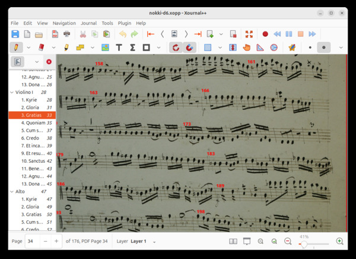

The manuscript PDF file is split into smaller parts for better version control
handling. Run `make` in this directory to reassemble the file.

Annotations, such as bar numbers, are added (overlaid) to the facsimile using
[Xournal++](https://xournalpp.github.io/).

